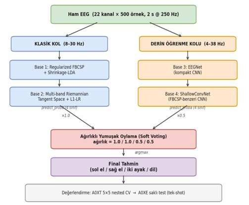
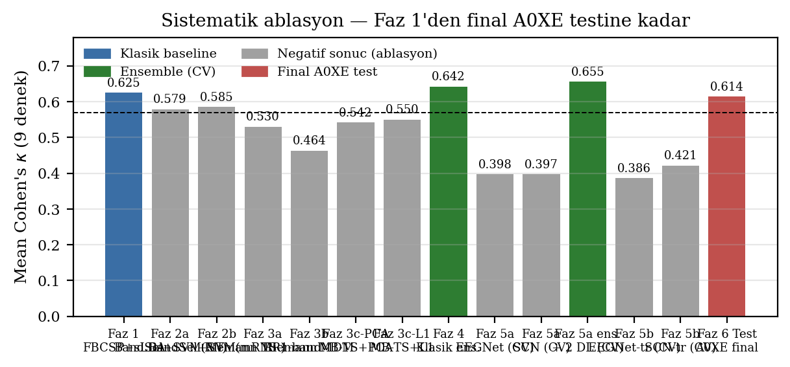
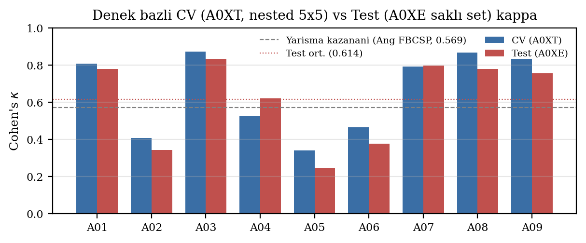
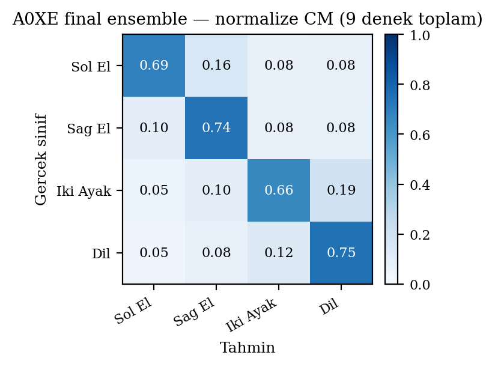

# bci-2a-ensemble — EEG Sinyali Sınıflandırması

**BCI Competition IV — Dataset 2a** üzerinde, denek-özel (subject-specific) **motor imagery** EEG
sınıflandırması. Hedef, hiçbir bilgi sızıntısı olmadan (dürüst nested CV) mümkün olan en yüksek
**Cohen's κ** değerini elde etmek ve klasik (FBCSP/Riemann) ile derin öğrenme (EEGNet/ShallowConvNet)
yaklaşımlarını **ağırlıklı yumuşak oylama (soft voting)** ile birleştirmektir.

4 sınıf: **sol el · sağ el · iki ayak · dil**.

---

## Sonuçlar (özet)

| Aşama | Yöntem | Mean Cohen's κ (9 denek) |
|:--|:--|:-:|
| Faz 1 — Baseline | FBCSP + Shrinkage-LDA | 0.625 |
| Faz 5 — Final ensemble | 4 base ağırlıklı soft voting (CV) | **0.655** |
| **Faz 6 — Final test** | A0XE saklı set (tek-shot) | **0.614** (acc 0.710) |
| Referans | Yarışma kazananı (Ang, FBCSP) | 0.569 |

> Test seti (`A0XE`) tüm geliştirme boyunca **saklı** tutuldu; rapor edilen 0.614, yalnızca final
> değerlendirmede tek seferlik açılan dürüst bir sonuçtur.

---

## Sistem Mimarisi

İki paralel kol, dört base öğrenici, ağırlıklı yumuşak oylama:



| Kol | Base | Yöntem | Ağırlık |
|:--|:--|:--|:-:|
| Klasik (8–30 Hz) | Base 1 | Regularized FBCSP + Shrinkage-LDA | 1.0 |
| Klasik (8–30 Hz) | Base 2 | Multi-band Riemannian Tangent Space + L1-LR | 1.0 |
| Derin (4–38 Hz) | Base 3 | EEGNet (kompakt CNN) | 0.5 |
| Derin (4–38 Hz) | Base 4 | ShallowConvNet (FBCSP-benzeri CNN) | 0.5 |

Her base 4 sınıf için `predict_proba` üretir; olasılıklar ağırlıklarla toplanır ve `argmax` ile
final tahmin verilir.

---

## Sistematik Ablasyon

Faz 1 baseline'dan final test sonucuna kadar denenen tüm yapı taşları ve katkıları:



- Tekil derin modeller (EEGNet/ShallowConvNet) tek başına baseline'ın altında kaldı.
- Asıl kazanç, klasik + derin kolların **birleştirilmesinden** geldi (Faz 5a ensemble, κ = 0.655).
- Saf 6/8-base "her şeyi birleştir" yaklaşımı geriledi; **dengeli 4-base** kombinasyonu en iyisi oldu.

---

## CV vs Test Tutarlılığı

Denek bazında çapraz-doğrulama (A0XT, nested 5×5) ve saklı test (A0XE) κ değerleri:



Belirgin **bimodal** dağılım: güçlü grup (A01, A03, A07, A08, A09 ≈ 0.80) ve zayıf grup
(A02, A04, A05, A06 ≈ 0.41). CV ile test çoğu denekte tutarlı; bu, modelin aşırı uyum yapmadığını
ve sonucun dürüst olduğunu gösterir.

---

## Karışıklık Matrisi (Final Ensemble, 9 denek toplam)



Köşegen değerleri 0.66–0.75 arası. En çok karışan çiftler "iki ayak ↔ dil" yönünde, beklenen
nöro-fizyolojik örtüşmeyle uyumlu.

---

## Veri Seti

| Öğe | Değer |
|:--|:--|
| Veri | BCI Competition IV — Dataset 2a |
| Denek | 9 (A01 … A09) |
| Sınıf | 4 — sol el / sağ el / iki ayak / dil |
| Eğitim | A0XT (288 trial/denek, dengeli 72/sınıf) |
| Test | A0XE (final için saklı) |
| Sampling | 250 Hz, 22 EEG + 3 EOG kanal |
| Epoch | cue + 0.5 s – 2.5 s ⇒ 500 örnek |

> **Not:** Ham `.gdf`/`.mat` veri dosyaları repoya dahil **değildir** (lisans/boyut). Verisetini
> [BCI Competition IV 2a](https://www.bbci.de/competition/iv/#dataset2a) sayfasından indirip
> `data/` klasörüne yerleştirin.

---

## Değerlendirme Protokolü

- **Dış CV:** `StratifiedKFold(n_splits=5, shuffle=True, random_state=42)`
- **İç CV:** klasik için `GridSearchCV`, derin için stratified %80/%20 split
- **Metrik:** Cohen's κ (ana), accuracy, macro-F1
- **Reproducibility:** tüm fazlar `random_state=42` → fold yapısı bit-bit aynı → ensemble hizalı
- **Leakage-free:** band/feature seçimi ve normalizasyon yalnız train-fold üzerinde fit edilir

---

## Proje Yapısı

```
.
├── data_loader.py            # .gdf yükleme, epoch'lama, (X, y) tensörleri
├── preprocessing.py          # filtreleme / artefakt
├── evaluation.py             # nested CV, CVResult, metrikler
├── main.py                   # deney çalıştırıcı (CLI)
├── experiments/              # her base ve ablasyon ayrı modül
│   ├── exp_fbcsp_rlda.py          # Base 1: FBCSP + Shrinkage-LDA
│   ├── exp_riemann_multiband_ts.py# Base 2: Multi-band Riemann TS
│   ├── exp_eegnet.py              # Base 3: EEGNet
│   ├── exp_shallowconvnet.py      # Base 4: ShallowConvNet
│   ├── exp_atcnet.py              # ATCNet (ablasyon)
│   ├── exp_ensemble.py            # ağırlıklı soft voting
│   └── exp_final_evaluation.py    # A0XE saklı set, tek-shot
└── results/
    ├── figures/              # README'deki grafikler
    ├── tables/               # tüm deney CSV'leri
    └── RESEARCH_LOG.md       # faz faz araştırma defteri
```

---

## Kurulum & Çalıştırma

```bash
pip install -r requirements.txt

# Tek bir pipeline'ı tüm denekler üzerinde çalıştır
python main.py --pipeline exp_fbcsp_rlda --all

# Final ensemble değerlendirmesi (A0XE saklı set)
python experiments/exp_final_evaluation.py
```

**Bağımlılıklar:** `mne`, `numpy`, `scipy`, `scikit-learn`, `pyriemann`, `matplotlib`, `pandas`, `joblib`.

---

## Ayrıntılı Araştırma Defteri

Her fazın hipotezi, pipeline ayrıntıları ve denek bazında sonuçları için bkz.
[results/RESEARCH_LOG.md](results/RESEARCH_LOG.md).
